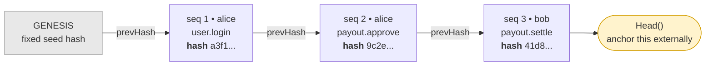
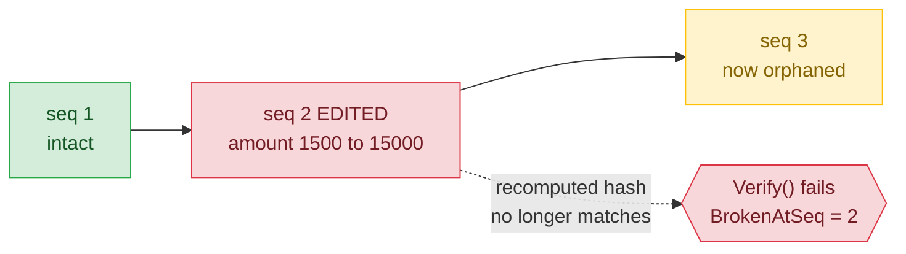
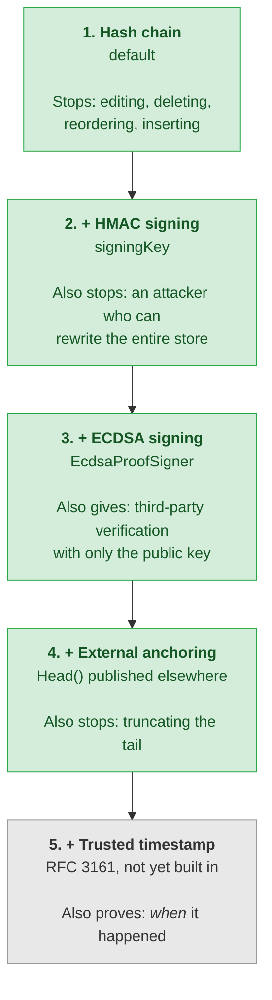

# ProofLog

**A tamper-evident, identity-bound audit log and a verifiable digital chain-of-custody.**

ProofLog is hash-chained, queryable, evidence-grade logging for systems that must prove *who did what, when* to an auditor, a regulator, or a court. The same properties that satisfy record-keeping regulations (CRA, DORA, NIS2, EU AI Act) also make it a **chain-of-custody** layer for digital evidence: every record is append-only, identity-bound, time-stamped, hash-chained, and optionally ECDSA-signed so an independent party can verify it with only the public key, without being able to forge it. Drop-in, SQLite-backed, with a one-call, self-verifying evidence export.

It is the open-source core of the CRADesk compliance line and the tamper-evident evidence store inside the commercial CRADesk dossier engine.

> **Scope of the guarantee.** ProofLog proves *integrity and order*: that records were not altered, reordered, or forged after the fact, verifiable by a third party with only the public key. It does **not** by itself prove *when* an event happened: timestamps come from the host clock, so an operator with write access could set the clock and build a self-consistent chain at any time. For an independent time guarantee, anchor the chain to a trusted timestamp authority (RFC 3161) or a public ledger. "Chain-of-custody evidence" here means integrity-grade, not a standalone claim of court admissibility, which depends on jurisdiction, process, and trusted time.
>
> **Known advisory (transitive).** Via `Microsoft.Data.Sqlite` this package pulls `SQLitePCLRaw.*.e_sqlite3`, covered by **CVE-2025-6965** (a SQLite memory-corruption bug fixed in SQLite 3.50.2). As of 2026-07 no patched SQLitePCLRaw release exists on the referenced line. ProofLog is **not affected in normal use**: it executes only its own fixed-schema, parameterized queries and never runs caller- or attacker-supplied SQL, so the vulnerable aggregate-query path is not reachable. The dependency is pinned to the newest maintained build (10.0.10) and will be bumped when SQLitePCLRaw ships the SQLite 3.50.2 fix.

[](https://github.com/w1ck3ds0d4/ProofLog/actions/workflows/ci.yml)
[](https://www.nuget.org/packages/ProofLog/)
[](https://www.nuget.org/packages/ProofLog/)
[](LICENSE)
[](https://dotnet.microsoft.com/)

---

## Contents

- [Why](#why) - what breaks without it
- [How it works](#how-it-works) - the chain, and what each tampering attempt trips
- [Install](#install) and [Quickstart](#quickstart)
- [Use it in an app](#use-it-in-an-app) - DI, one line
- [Signing](#signing-optional-recommended-for-high-assurance) - HMAC and auditor-verifiable ECDSA
- [Evidence export](#evidence-export) - regulator profiles, chain of custody
- [API](#api) - the whole surface
- [Assurance ladder](#assurance-ladder) - how far each configuration gets you

---

## Why

Ordinary logs are editable. If an attacker (or an insider) can change history, your logs can't *prove* anything to a regulator or a court. ProofLog makes every record **cryptographically chained** to the one before it: change, delete, reorder, or insert a single entry and verification fails at exactly that point. Each record is also **identity-bound** - the actor is part of the chain, so you can't later rewrite who did something.

## Install

```bash
dotnet add package ProofLog
```

Targets .NET 8.0. Published to NuGet on each version tag (`v*`) via Trusted Publishing, so no long-lived API key exists for this repository.

## Quickstart

```csharp
using ProofLog;

// Durable, file-backed log (or InMemoryProofLog for tests / embedding).
using var log = new SqliteProofLog("audit.db");

log.Append(new AuditEntry { Actor = "alice", Action = "user.login", Resource = "session/abc" });
log.Append(new AuditEntry { Actor = "alice", Action = "payout.approve", Resource = "payout/42", Data = "{\"amount\":1500}" });

// Verify the whole chain - O(n), no external service.
VerificationResult v = log.Verify();
Console.WriteLine(v.Ok ? "intact" : $"TAMPERED at #{v.BrokenAtSeq}: {v.Reason}");

// One-call, self-verifying evidence export for an auditor.
File.WriteAllText("evidence.json", Evidence.ToJson(log));
```

**Try it locally** (no install needed):

```bash
dotnet run --project samples/ProofLog.Demo
```

It appends a chain, verifies it, then rewrites a record directly in the database and watches verification fail at exactly that record.

For a worked use case, `dotnet run --project samples/ProofSettle.Demo` records signed **settlement-evidence** for a few mock prediction markets, exports an MGA-profiled bundle a regulator or player verifies with only the public key, then flips one market in the raw database and watches independent verification catch it - the independent proof an operator's own (mutable) logs can't be.

## Use it in an app

```csharp
// DI (ASP.NET Core / worker) - one line:
builder.Services.AddProofLog("audit.db");      // optional signingKey: key

// inject IProofLog anywhere and append, no ceremony:
log.Append("alice", "payout.approve", "payout/42", "{\"amt\":1500}");

// or record AND emit through your existing ILogger in one call -
// observability and tamper-evident evidence together:
logger.Audit(log, "alice", "payout.approve", "payout/42");
```

## How it works

Every record carries the hash of the record before it, so the log is a chain rather than a list. Each link commits to everything behind it.



Each record's hash is:

```
hash_i = SHA-256( hash_{i-1}  ||  seq  ||  timestamp  ||  actor  ||  action  ||  resource  ||  data )
```

Fields are **length-prefixed** before hashing, so no value can be crafted to forge an equivalent encoding. The first record chains from a fixed genesis hash. `Verify()` walks the log, recomputes every hash from the stored fields, and checks each record's `PrevHash` against the actual previous hash and that sequence numbers are contiguous.

Because record 3 commits to record 2, which commits to record 1, altering anything in the middle invalidates every link after it. Verification reports the exact sequence number where the break occurs:



| Tampering | Detected by |
| --- | --- |
| Edit a field (actor, action, data, time) | content hash mismatch |
| Overwrite a stored hash | content hash mismatch |
| Delete a record | sequence break + prev-hash mismatch |
| Insert or reorder records | sequence break + prev-hash mismatch |
| **Truncate the tail** | anchor `Head()` externally - see below |

### A note on truncation

Deleting records from the *end* leaves a chain that's still internally consistent - that's a fundamental property of hash chains, not a bug. `Head()` returns the current chain-head hash; anchor it somewhere the attacker can't reach (publish it, notarize it, send it to a second system), then verify against it:

```csharp
var anchored = log.Verify(savedHead);   // checks the chain AND that the head matches
```

If records were truncated (or appended) since `savedHead` was recorded, the heads won't match and verification fails. ProofLog is honest about this rather than pretending a local-only log can detect its own truncation.

## Signing (optional, recommended for high assurance)

A bare hash chain has one gap: an attacker with **full write access** to the store can rewrite the *whole* chain - recomputing every hash - and `Verify()` passes (the hashes are public, so anyone can recompute them). Pass a **signing key** and that stops working: each record also carries an HMAC-SHA-256 over its hash, and verification fails unless the record was produced with the key.

```csharp
byte[] key = /* from a secret store / KMS, NOT in code */;
using var log = new SqliteProofLog("audit.db", signingKey: key);
log.Append(new AuditEntry { Actor = "alice", Action = "payout.approve" });
log.Verify();   // also checks every record's MAC
```

An attacker who can rewrite the database but doesn't have the key cannot forge a valid record. Keep the key out of the same trust boundary as the log (a KMS, an HSM, a separate service). Unsigned logs are unchanged and fully supported.

### Asymmetric signing (auditor-verifiable, v0.3)

HMAC has one limitation for evidence you hand to a third party: the same key signs *and* verifies, so whoever can verify can also forge. For a dossier given to a regulator you want the opposite - they should be able to **verify without being able to forge**. Pass an `EcdsaProofSigner` (NIST P-256, built on the .NET BCL, no extra dependency): you keep the **private key**, and the auditor verifies with only the **public key**.

```csharp
using var signer = EcdsaProofSigner.Create();      // or FromPrivateKey(base64) from your vault
string publicKey = signer.ExportPublicKey();        // publish this with the evidence

using (var log = new SqliteProofLog("audit.db", signer))
    log.Append(new AuditEntry { Actor = "alice", Action = "payout.approve" });

// The auditor, holding ONLY the public key, can verify but not append or forge:
using var auditor = EcdsaProofSigner.FromPublicKey(publicKey);
using var check = new SqliteProofLog("audit.db", auditor);
check.Verify();          // true - the chain was produced by the private key
check.Append(/* ... */); // throws: a verify-only (public) key cannot extend the trail
```

Same `Verify()`, same `Mac` column - the signature is just public-key now. `AddProofLog(path, signer)` wires it through DI.

## Evidence export

`Evidence.ToJson(log)` produces a portable bundle - every record plus the head hash and a fresh verification statement. An auditor needs nothing but that file and the public hashing rule above to **independently replay the chain** and confirm it.

### Regulator profiles

Tag the export with a named profile so the bundle states which obligation it speaks to and maps that obligation onto ProofLog's properties:

```csharp
string json = Evidence.ToJson(log, RegulatorProfiles.Cra);   // or "dora", "nis2", "eu-ai-act", "mga-gaming", "digital-evidence"
```

| Key | Framework | Obligation it addresses |
| --- | --- | --- |
| `cra` | EU Cyber Resilience Act | Vulnerability handling + technical documentation (Annex I Part II, Art. 13/14) |
| `dora` | EU DORA | ICT incident management + auditable records (Art. 17-19) |
| `nis2` | EU NIS2 Directive | Risk-management measures incl. logging + incident reporting (Art. 21/23) |
| `eu-ai-act` | EU AI Act | Automatic record-keeping / traceability for high-risk AI (Art. 12/19) |
| `mga-gaming` | Malta Gaming Authority | Gaming-transaction record-keeping + evidencing how a contested / voided market resolved |
| `digital-evidence` | ISO/IEC 27037 + 27043 | Digital-evidence chain of custody: documented custody, provable integrity, authenticated origin, independent verifiability |

The profiled bundle adds the framework, the regulation reference, the requirement-to-property mapping, a `signed` flag, and a standing disclaimer (it documents log *integrity*, not compliance - not legal advice).

### Digital evidence and chain of custody

The `digital-evidence` profile is the forensic framing of the same engine. Courts and investigators judge digital evidence on four things, and each maps directly onto a ProofLog property: **documented custody** (append-only, identity-bound records), **provable integrity** (the hash chain catches any post-collection alteration), **authenticated origin** (an ECDSA signature ties the trail to a key the collector controls), and **independent verifiability** (the public canonicalization rule + public key let a court or opposing expert replay and verify without trusting the holder). Bind an artifact's hash into a record at the moment of collection and the trail becomes the artifact's chain of custody, mapped to ISO/IEC 27037 (collection / acquisition / preservation) and 27043 (the investigation process).

## API

| Type | Purpose |
| --- | --- |
| `IProofLog` | `Append`, `Read`, `Head`, `Count`, `Verify` |
| `SqliteProofLog` | durable SQLite-backed store |
| `InMemoryProofLog` | non-durable store for tests / embedding |
| `AuditEntry` | what you append (actor + action required) |
| `ProofRecord` | a committed, chained record |
| `Evidence` | one-call JSON evidence export, plain or profiled |
| `RegulatorProfiles` | named CRA / DORA / NIS2 / EU AI Act export profiles |
| `Hashing` | the canonicalization + SHA-256 rule (so anyone can re-verify) |
| `IProofSigner` | record signing - `HmacProofSigner` (symmetric) or `EcdsaProofSigner` (asymmetric, auditor-verifiable) |

## Assurance ladder

Each rung defends against a strictly stronger attacker. Pick the lowest one that covers your threat model; every rung is fully supported.



| Rung | Defends against | Cost |
| --- | --- | --- |
| 1. Hash chain (default) | anyone editing, deleting, reordering or inserting records | none |
| 2. HMAC signing | an attacker with full write access rewriting the whole chain | manage one secret key |
| 3. ECDSA signing | the same, and lets an auditor verify without any secret | manage a private key, publish the public one |
| 4. Anchor `Head()` externally | truncation of the tail (a hash chain cannot self-detect this) | somewhere to publish the head |
| 5. Trusted timestamp (RFC 3161) | backdating by an operator who controls the host clock | not built in yet, see the scope note above |

## Tech stack

| Layer | Technology |
| --- | --- |
| Library | .NET 8 (C#), zero runtime dependencies beyond Microsoft.Data.Sqlite |
| Store | SQLite (durable) or in-memory |
| Crypto | SHA-256 hash chain, HMAC-SHA256 / ECDSA P-256 signing (.NET BCL) |
| Tests | xUnit, 49 tests incl. tamper/forgery scenarios |

## Roadmap

- **v0.1** *(done)* - core append + hash-chain + identity binding + verify, SQLite store, tamper-detection tests, evidence export, CI.
- **v0.2** *(done)* - optional HMAC signing (defeats a full-chain rewrite), with backward-compatible unsigned logs.
- **v0.3** *(done)* - asymmetric ECDSA P-256 signing: hand an auditor the public key so they verify the chain without being able to forge it (`EcdsaProofSigner`).
- **v0.4** *(done)* - named export profiles (CRA / DORA / NIS2 / EU AI Act / MGA-gaming / **digital-evidence** ISO/IEC 27037+27043): tag an evidence bundle with the obligation or forensic standard it addresses and the requirement-to-property mapping.
- **Later** - OpenTelemetry bridge, additional stores, Rust core; an `EvidenceVault` layer that binds artifact hashes + trusted timestamps into a per-case custody chain (the chain-of-custody product on top of this core).

## License

This project is licensed under:

- [Apache 2.0](LICENSE) - permissive on purpose. ProofLog is meant to be adopted.
